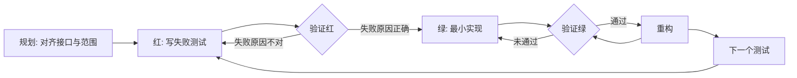

# 测试驱动开发（TDD）

## 一句话原则
**先写测试，看着它失败，再写刚好能让它通过的代码。**
如果你没看到测试失败，就不知道它测的是不是对的。

## 为什么 TDD 在 AI 辅助编程中更重要

失败的测试是最精确的 prompt，能把范围锁死在「刚好够用的最小实现」，避免 AI 一上来就加 YAGNI 配置。每次 green 都是一个可回滚的安全点。

## 什么时候用
- 新功能
- 修 bug（先写能复现 bug 的测试）
- 重构
- 改行为

**例外（需用户同意）：** 一次性草稿、自动生成的代码、纯配置文件

## 铁律
```
没有先失败的测试，就不许写生产代码。
```

如果你已经先写了代码：**删掉它，从头来。**
不许留着当"参考"，不许边写测试边"适配"。

## 红灯信号

以下任何想法都意味着你在合理化「测试后置」：

- "我先写一点代码当参考" / "这次情况特殊" / "删了太浪费"
- "TDD 太慢" / "我手动测过了" / "太简单了不需要测"
- "先探索一下再说" / "TDD 太教条，务实就该灵活"

**停止当前工作，删掉未测试的代码，从 TDD 重新开始。**

## 红-绿-重构循环



> 以下以 TypeScript 演示流程，**仅作参考**。实际必须使用当前项目的语言、框架和目录结构。各语言完整示例见 `references/`。

### 规划：写代码前先对齐

**写测试前，必须确认：**
1. 要新增/修改的公开接口长什么样？
2. 哪些行为最关键、必须优先测？
3. 项目是否有现有测试规范需要遵循？
4. **项目是否已有日志模块？如果没有，必须先搭建日志模块，确保测试输出和运行时可观测。**

> **深模块原则**：接口越小，测试越简洁。如果接口和实现一样复杂，说明模块太浅。

### 红：写失败的测试

写一个最小、最清晰的测试，表达你想要的行为。

**核心约束：Vertical Slicing**
每次只写**一个**测试，确认它失败后，再写最小实现让它通过。严禁「先写一批测试，再批量写实现」。

**要求：**
- 一个测试只测一件事
- 名字清楚说明行为
- 尽量用真实代码，不要 mock（除非迫不得已）
- 基于「期望的公开接口」设计测试，不要提前猜测内部实现

**坏例子：**
```typescript
test('retry 能用', async () => {
  const mock = jest.fn().mockRejectedValueOnce(new Error()).mockResolvedValueOnce('success');
  await retryOperation(mock);
  expect(mock).toHaveBeenCalledTimes(2);
});
```
（测的是 mock，不是真实行为。）

### 验证红

运行测试，确认：
- 测试确实失败了（不是报错）
- 失败信息是预期的
- 失败是因为功能还没写

**如果测试通过了** → 测的是已有行为，重写测试。  
**如果测试报错了** → 修语法错误，再跑到正确失败为止。

### 绿：写最小实现

写刚好能让测试通过的最简代码。不要提前加配置 —— **YAGNI**。

### 验证绿

运行测试，确认：
- 测试通过
- 别的测试没坏
- 没有警告、报错

### 重构

测试全部通过之后，才能做：去重、改名、抽小函数。
**保持测试绿色，不要在重构时加新行为。**

### 重复循环

重构完成后，回到「红」阶段写**下一个**测试。始终遵循：
```
一个测试 → 一个实现 → 验证通过 → 可选重构 → 下一个测试
```

### 修 bug 时的 TDD

1. **红**：写测试，复现 bug（测试应失败）
2. **验证红**：确认失败信息与 bug 现象一致
3. **绿**：改最小代码让测试通过
4. **验证绿**：测试通过，且没有破坏其他功能

**示例：**
```typescript
// 红
test('rejects empty email', async () => {
  const result = await submitForm({ email: '' });
  expect(result.error).toBe('Email required');
});
// 预期：FAIL: expected 'Email required', got undefined

// 绿
function submitForm(data: FormData) {
  if (!data.email?.trim()) return { error: 'Email required' };
  // ...
}
```

---

## 测试类型与组织

| 类型 | 测什么 | 何时必须写 |
|------|--------|-----------|
| **单元测试** | 单个函数、纯逻辑、工具函数 | Always |
| **集成测试** | API 端点、数据库操作、外部服务调用 | Always |
| **E2E 测试** | 关键用户流程（如 Playwright） | 核心路径 |

### 文件组织原则
优先遵循项目已有的测试目录结构。常见模式：
- **同目录并列**：`Button.tsx` + `Button.test.tsx`
- **独立测试目录**：`tests/`、`__tests__/`、`e2e/`

> 若项目已有明确规范，**严格按项目规范执行**。

---

## 工程实践

### 日志模块前置检查

在写任何测试或实现之前，必须确认项目具备可运行的日志模块：
- **检查**：项目是否已有统一的日志配置（如 Python 的 `logging`、Node 的 `winston`/`pino`、Go 的 `log`/`zap`、Java 的 `SLF4J`/`Logback`）
- **搭建**：如果没有，**必须先搭建日志模块**，再进入 TDD 循环
- **要求**：日志输出级别完整（DEBUG/INFO/WARN/ERROR），包含时间戳、模块名、上下文信息；测试失败时能通过日志快速定位问题
- **原因**：没有日志的测试等于盲测，无法确认失败是预期行为还是环境/配置问题

### Mock 策略
- **优先真实**：先用真实依赖跑测试，确定失败后再决定 mock 哪一层
- **外部服务必须隔离**：数据库、Redis、AI API 等在单元测试中必须 mock
- **完整镜像**：mock 必须包含真实 API 的完整数据结构，不能只填当前测试用到的字段

常见外部依赖处理：
- **数据库**：优先用内存版或测试容器，避免 mock ORM
- **HTTP 服务**：前端用 MSW，后端用 `nock`/`responses`
- **Redis / 第三方 SDK**：mock 客户端层，返回完整响应结构

### CI/CD 集成

```bash
# 预提交钩子
npm test && npm run lint
```

```yaml
# GitHub Actions 示例
- name: Run Tests
  run: npm test -- --coverage
```

---

## AI 常见作弊模式与防范

| 作弊模式 | 表现 | 防范措施 |
|---------|------|---------|
| **水平切片** | 一次性写 5-10 个测试，再批量写实现 | 强制 Vertical Slicing：一次只写一个测试 |
| **改测试绕过失败** | 把断言改宽松或删掉 | 确认每次失败都是因为「功能未实现」 |
| **用 mock 替代真实逻辑** | 大量 mock 内部函数，测试变成验证 mock 调用 | 优先用真实依赖；mock 只隔离外部慢/不稳定依赖 |
| **先写实现再补测试** | 声称「探索一下」，然后直接给完整代码 | 探索代码必须删除，从 TDD 重新开始 |
| **测试与实现一起给** | 在一个代码块里同时给出两者 | 拒绝这种输出，要求先给测试 |

如果你发现自己正在做以上任何一件事：**停止，回退到上一个 green 状态，重新开始。**

---

## 测试反模式

写测试前必读 `references/testing-anti-patterns.md`。SKILL.md 中不再重复罗列，以避免维护不一致。

---

## 技术栈判断与读取对应指南

| 技术栈 | 判断信号 | 读取文件 |
|--------|----------|----------|
| **Python（通用）** | 纯脚本/库/CLI，无 Web 框架 | `references/python.md` |
| **Python 后端** | `fastapi`、`flask`、`django`、`uvicorn`、`starlette` 任一出现 | `references/python-backend-patterns.md` |
| **TypeScript 前端** | `package.json` + `react`/`vue`、`.tsx` 为主 | `references/typescript-frontend.md` |
| **C++** | `CMakeLists.txt`、`.cpp` 为主，无 Qt 特征 | `references/cpp.md` |
| **Qt Widget** | `.pro`、`.ui` 文件，大量 `QWidget` | `references/qwidget.md` |
| **Qt QML** | `.qml` 文件或 `QQmlApplicationEngine` | `references/qml.md` |
| **Go** | `go.mod`、`.go` 文件为主 | `references/go.md` |

**重要提示**：`references/` 文件**仅供参考**。若项目已有自己的测试规范，**优先按项目现有规范执行**，不可生搬硬套。

---

## 各技术栈测试命令速查

| 技术栈 | 运行全部测试 | 运行单个文件 | 失败即停/常用参数 |
|--------|-------------|-------------|------------------|
| Node.js | `npm test` | `npm test <path-to-test>` | `--coverage`, `--watch` |
| Python | `pytest` | `pytest <path-to-test> -v` | `-x`, `--cov=<pkg>` |
| Go | `go test ./...` | `go test <package> -v` | `-failfast`, `-cover` |
| C++ | `cmake --build build && ctest --output-on-failure` | `./tests/test_name --gtest_filter=Suite.Test` | `--output-on-failure` |

---

## 卡住怎么办

| 问题 | 解决方案 |
|------|----------|
| 不知道怎么写测试 | 先写你期望的 API 调用方式，再写断言。还是不会？问用户。 |
| 测试太复杂 | 设计太复杂。简化接口，把大函数拆成小函数。 |
| 必须 mock 一切才能测 | 代码耦合度太高。用依赖注入或接口隔离。 |
| 测试 setup 代码巨长 | 提取 test helpers。如果还长，说明设计需要简化。 |

## 完成检查清单

- [ ] 写测试前与用户确认了接口和测试范围
- [ ] **已检查/搭建日志模块，日志输出完整可观测**
- [ ] 每个新函数/方法都有测试
- [ ] 每个测试都在实现前看到它失败
- [ ] 用最小代码让测试通过
- [ ] 全部测试通过，没有警告和报错
- [ ] 尽量用真实代码（mock 仅必要时用）
- [ ] 覆盖了异常和边界情况
- [ ] 没有使用「水平切片」（批量写测试后批量写实现）

有一项未满足？回到对应阶段补全，不要标记完成。
